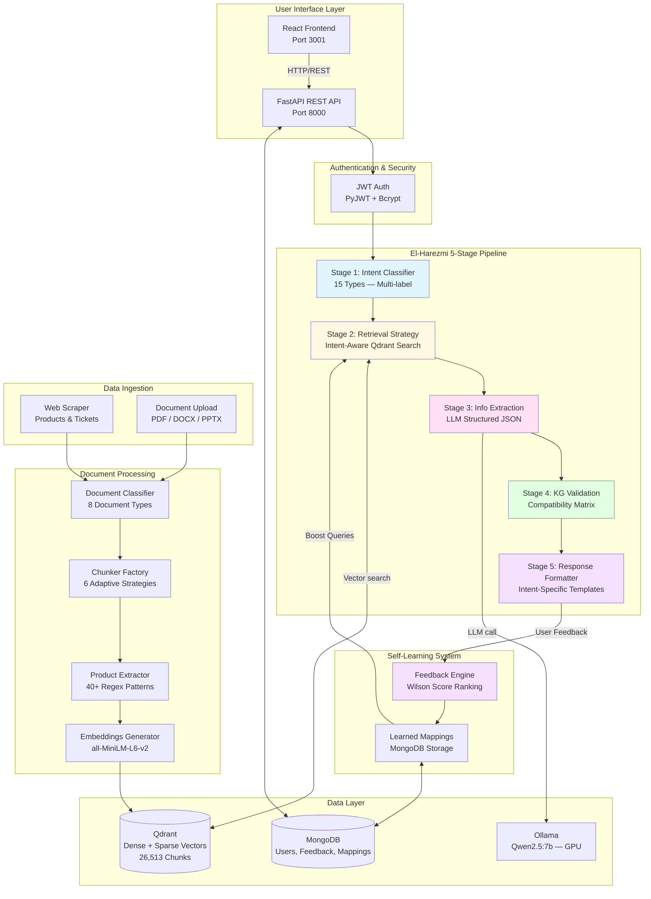
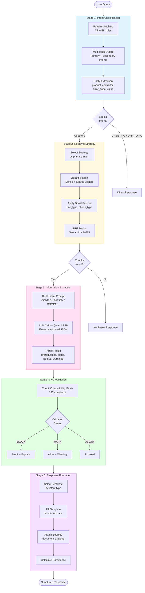
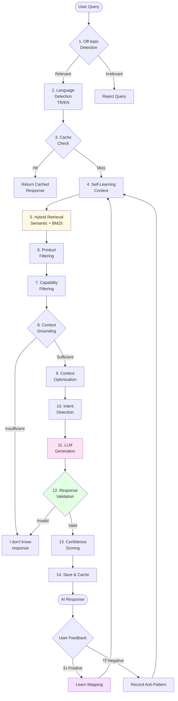
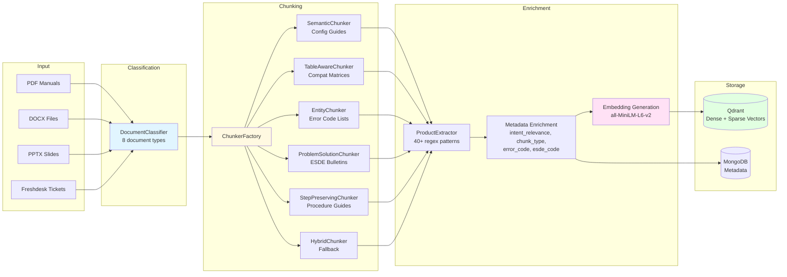
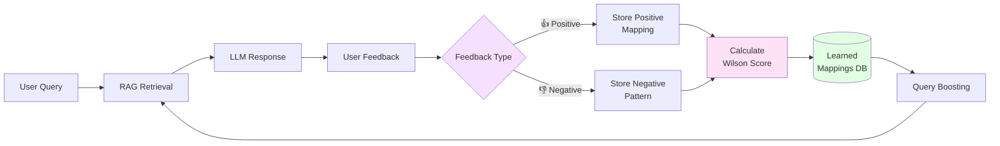
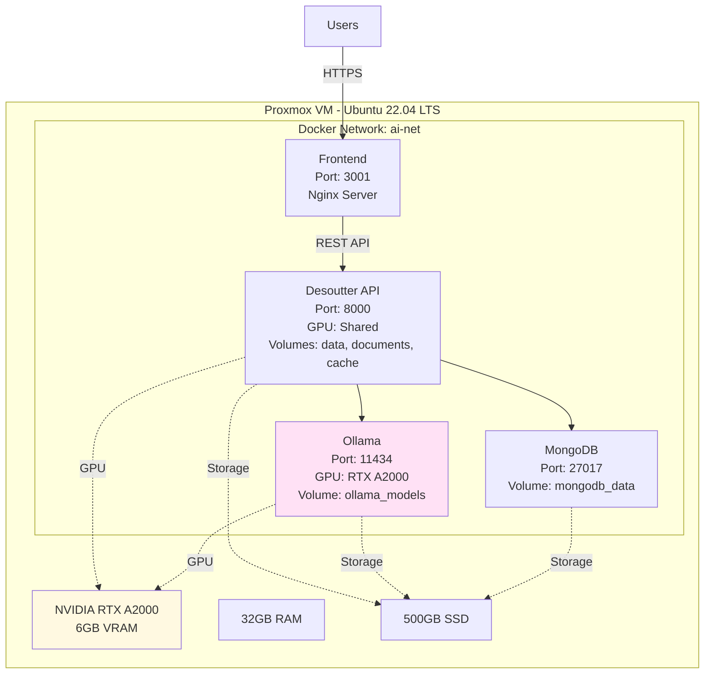
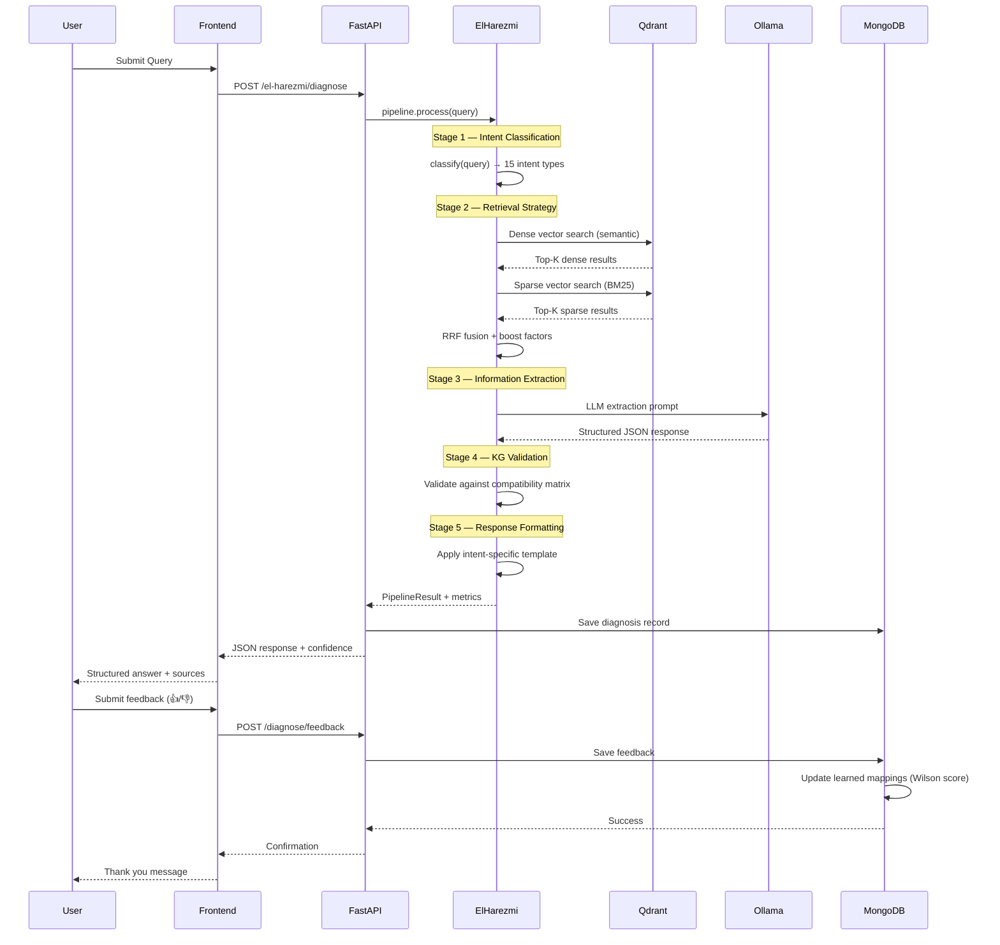
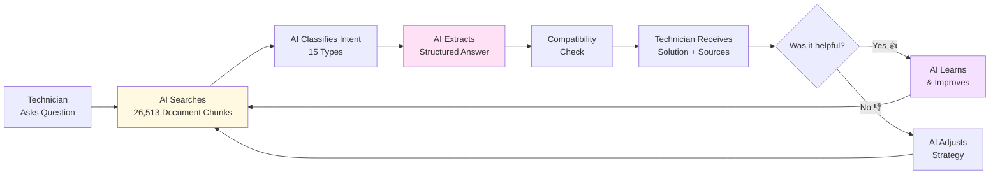

# Desoutter Assistant — Architecture Diagrams

**Visual representations for presentations and documentation (v2.0.1)**

---

## Table of Contents

1. [Complete System Architecture](#1-complete-system-architecture)
2. [El-Harezmi 5-Stage Pipeline](#2-el-harezmi-5-stage-pipeline)
3. [Legacy RAG Pipeline Flow](#3-legacy-rag-pipeline-flow)
4. [Data Processing Pipeline](#4-data-processing-pipeline)
5. [Self-Learning Loop](#5-self-learning-loop)
6. [Deployment Architecture](#6-deployment-architecture)
7. [Component Interaction Diagram](#7-component-interaction-diagram)

---

## 1. Complete System Architecture

```mermaid
graph TB
    subgraph "User Interface Layer"
        A[React Frontend<br/>Port 3001]
        B[FastAPI REST API<br/>Port 8000]
    end

    subgraph "Authentication & Security"
        C[JWT Auth<br/>PyJWT + Bcrypt]
    end

    subgraph "El-Harezmi 5-Stage Pipeline"
        EH1[Stage 1: Intent Classifier<br/>15 Types — Multi-label]
        EH2[Stage 2: Retrieval Strategy<br/>Intent-Aware Qdrant Search]
        EH3[Stage 3: Info Extraction<br/>LLM Structured JSON]
        EH4[Stage 4: KG Validation<br/>Compatibility Matrix]
        EH5[Stage 5: Response Formatter<br/>Intent-Specific Templates]
    end

    subgraph "Self-Learning System"
        J[Feedback Engine<br/>Wilson Score Ranking]
        K[Learned Mappings<br/>MongoDB Storage]
    end

    subgraph "Document Processing"
        L[Document Classifier<br/>8 Document Types]
        M[Chunker Factory<br/>6 Adaptive Strategies]
        N[Product Extractor<br/>40+ Regex Patterns]
        O[Embeddings Generator<br/>all-MiniLM-L6-v2]
    end

    subgraph "Data Layer"
        P[(MongoDB<br/>Users, Feedback, Mappings)]
        Q[(Qdrant<br/>Dense + Sparse Vectors<br/>26,513 Chunks)]
        R[Ollama<br/>Qwen2.5:7b — GPU]
    end

    subgraph "Data Ingestion"
        S[Web Scraper<br/>Products & Tickets]
        T[Document Upload<br/>PDF / DOCX / PPTX]
    end

    A -->|HTTP/REST| B
    B --> C
    C --> EH1
    EH1 --> EH2
    EH2 --> EH3
    EH3 --> EH4
    EH4 --> EH5

    EH3 -->|LLM call| R
    EH2 <-->|Vector search| Q
    EH5 -->|User Feedback| J
    J --> K
    K -->|Boost Queries| EH2

    S --> L
    T --> L
    L --> M
    M --> N
    N --> O
    O --> Q

    B <--> P
    K <--> P

    style EH1 fill:#e1f5ff
    style EH2 fill:#fff9e1
    style EH3 fill:#ffe1f5
    style EH4 fill:#e1ffe1
    style EH5 fill:#f5e1ff
    style J fill:#f5e1ff
```

---

## 2. El-Harezmi 5-Stage Pipeline

```mermaid
flowchart TD
    Q([User Query]) --> S1

    subgraph S1 ["Stage 1: Intent Classification"]
        direction TB
        I1[Pattern Matching<br/>TR + EN rules]
        I2[Multi-label Output<br/>Primary + Secondary intents]
        I3[Entity Extraction<br/>product, controller, error_code, value]
        I1 --> I2
        I2 --> I3
    end

    S1 --> S1_out{Special<br/>Intent?}
    S1_out -->|GREETING / OFF_TOPIC| DirectResp[Direct Response]
    S1_out -->|All others| S2

    subgraph S2 ["Stage 2: Retrieval Strategy"]
        direction TB
        R1[Select Strategy<br/>by primary intent]
        R2[Qdrant Search<br/>Dense + Sparse vectors]
        R3[Apply Boost Factors<br/>doc_type, chunk_type]
        R4[RRF Fusion<br/>Semantic + BM25]
        R1 --> R2 --> R3 --> R4
    end

    S2 --> S2_out{Chunks<br/>found?}
    S2_out -->|No| NoResult[No Result Response]
    S2_out -->|Yes| S3

    subgraph S3 ["Stage 3: Information Extraction"]
        direction TB
        E1[Build Intent Prompt<br/>CONFIGURATION / COMPAT...]
        E2[LLM Call — Qwen2.5:7b<br/>Extract structured JSON]
        E3[Parse Result<br/>prerequisites, steps, ranges, warnings]
        E1 --> E2 --> E3
    end

    S3 --> S4

    subgraph S4 ["Stage 4: KG Validation"]
        direction TB
        V1[Check Compatibility Matrix<br/>237+ products]
        V2{Validation<br/>Status}
        V2 -->|BLOCK| Block[Block + Explain]
        V2 -->|WARN| Warn[Allow + Warning]
        V2 -->|ALLOW| Allow[Proceed]
        V1 --> V2
    end

    S4 --> S5

    subgraph S5 ["Stage 5: Response Formatter"]
        direction TB
        F1[Select Template<br/>by intent type]
        F2[Fill Template<br/>structured data]
        F3[Attach Sources<br/>document citations]
        F4[Calculate Confidence]
        F1 --> F2 --> F3 --> F4
    end

    S5 --> End([Structured Response])

    style S1 fill:#e1f5ff,stroke:#90caf9
    style S2 fill:#fff9e1,stroke:#ffe082
    style S3 fill:#ffe1f5,stroke:#f48fb1
    style S4 fill:#e1ffe1,stroke:#a5d6a7
    style S5 fill:#f5e1ff,stroke:#ce93d8
```

---

## 3. Legacy RAG Pipeline Flow

> ⚠️ The legacy 14-stage pipeline is maintained for backward compatibility. New queries are routed through El-Harezmi (Stage 2 above).

```mermaid
flowchart TD
    Start([User Query]) --> Stage1{1. Off-topic<br/>Detection}
    Stage1 -->|Relevant| Stage2[2. Language<br/>Detection<br/>TR/EN]
    Stage1 -->|Irrelevant| Reject[Reject Query]

    Stage2 --> Stage3{3. Cache<br/>Check}
    Stage3 -->|Hit| Return[Return Cached<br/>Response]
    Stage3 -->|Miss| Stage4[4. Self-Learning<br/>Context]

    Stage4 --> Stage5[5. Hybrid Retrieval<br/>Semantic + BM25]
    Stage5 --> Stage6[6. Product<br/>Filtering]
    Stage6 --> Stage7[7. Capability<br/>Filtering]

    Stage7 --> Stage8{8. Context<br/>Grounding}
    Stage8 -->|Insufficient| IDK[I don't know<br/>response]
    Stage8 -->|Sufficient| Stage9[9. Context<br/>Optimization]

    Stage9 --> Stage10[10. Intent<br/>Detection]
    Stage10 --> Stage11[11. LLM<br/>Generation]

    Stage11 --> Stage12{12. Response<br/>Validation}
    Stage12 -->|Invalid| IDK
    Stage12 -->|Valid| Stage13[13. Confidence<br/>Scoring]

    Stage13 --> Stage14[14. Save & Cache]
    Stage14 --> End([AI Response])

    End --> Feedback{User Feedback}
    Feedback -->|👍 Positive| Learn[Learn Mapping]
    Feedback -->|👎 Negative| AntiLearn[Record Anti-Pattern]

    Learn --> Stage4
    AntiLearn --> Stage4

    style Stage5 fill:#fff9e1
    style Stage11 fill:#ffe1f5
    style Stage12 fill:#e1ffe1
    style Learn fill:#f5e1ff
```

---

## 4. Data Processing Pipeline

```mermaid
flowchart LR
    subgraph Input
        A[PDF Manuals]
        B[DOCX Files]
        C[PPTX Slides]
        D[Freshdesk Tickets]
    end

    subgraph Classification
        CL[DocumentClassifier<br/>8 document types]
    end

    subgraph Chunking
        CF[ChunkerFactory]
        SC[SemanticChunker<br/>Config Guides]
        TC[TableAwareChunker<br/>Compat Matrices]
        EC[EntityChunker<br/>Error Code Lists]
        PC[ProblemSolutionChunker<br/>ESDE Bulletins]
        SPC[StepPreservingChunker<br/>Procedure Guides]
        HC[HybridChunker<br/>Fallback]
    end

    subgraph Enrichment
        PE[ProductExtractor<br/>40+ regex patterns]
        ME[Metadata Enrichment<br/>intent_relevance, chunk_type,<br/>error_code, esde_code]
        EM[Embedding Generation<br/>all-MiniLM-L6-v2]
    end

    subgraph Storage
        QD[(Qdrant<br/>Dense + Sparse Vectors)]
        MG[(MongoDB<br/>Metadata)]
    end

    A --> CL
    B --> CL
    C --> CL
    D --> CL

    CL --> CF
    CF --> SC
    CF --> TC
    CF --> EC
    CF --> PC
    CF --> SPC
    CF --> HC

    SC --> PE
    TC --> PE
    EC --> PE
    PC --> PE
    SPC --> PE
    HC --> PE

    PE --> ME
    ME --> EM
    EM --> QD
    ME --> MG

    style CL fill:#e1f5ff
    style CF fill:#fff9e1
    style EM fill:#ffe1f5
    style QD fill:#e1ffe1
```

---

## 5. Self-Learning Loop

```mermaid
graph LR
    A[User Query] --> B[RAG Retrieval]
    B --> C[LLM Response]
    C --> D[User Feedback]

    D --> E{Feedback Type}
    E -->|👍 Positive| F[Store Positive<br/>Mapping]
    E -->|👎 Negative| G[Store Negative<br/>Pattern]

    F --> H[Calculate<br/>Wilson Score]
    G --> H

    H --> I[(Learned<br/>Mappings DB)]
    I --> J[Query Boosting]
    J --> B

    style E fill:#f5e1ff
    style H fill:#ffe1f5
    style I fill:#e1ffe1
```

---

## 6. Deployment Architecture

```mermaid
graph TB
    subgraph "Proxmox VM - Ubuntu 22.04 LTS"
        subgraph "Docker Network: ai-net"
            A[MongoDB<br/>Port: 27017<br/>Volume: mongodb_data]
            B[Ollama<br/>Port: 11434<br/>GPU: RTX A2000<br/>Volume: ollama_models]
            C[Desoutter API<br/>Port: 8000<br/>GPU: Shared<br/>Volumes: data, documents, cache]
            D[Frontend<br/>Port: 3001<br/>Nginx Server]
        end

        E[NVIDIA RTX A2000<br/>6GB VRAM]
        F[32GB RAM]
        G[500GB SSD]
    end

    H[Users] -->|HTTPS| D
    D -->|REST API| C
    C --> A
    C --> B

    B -.GPU.-> E
    C -.GPU.-> E

    A -.Storage.-> G
    B -.Storage.-> G
    C -.Storage.-> G

    style B fill:#ffe1f5
    style E fill:#fff9e1
```

---

## 7. Component Interaction Diagram

```mermaid
sequenceDiagram
    participant User
    participant Frontend
    participant FastAPI
    participant ElHarezmi
    participant Qdrant
    participant Ollama
    participant MongoDB

    User->>Frontend: Submit Query
    Frontend->>FastAPI: POST /el-harezmi/diagnose
    FastAPI->>ElHarezmi: pipeline.process(query)

    Note over ElHarezmi: Stage 1 — Intent Classification
    ElHarezmi->>ElHarezmi: classify(query) → 15 intent types

    Note over ElHarezmi: Stage 2 — Retrieval Strategy
    ElHarezmi->>Qdrant: Dense vector search (semantic)
    Qdrant-->>ElHarezmi: Top-K dense results
    ElHarezmi->>Qdrant: Sparse vector search (BM25)
    Qdrant-->>ElHarezmi: Top-K sparse results
    ElHarezmi->>ElHarezmi: RRF fusion + boost factors

    Note over ElHarezmi: Stage 3 — Information Extraction
    ElHarezmi->>Ollama: LLM extraction prompt
    Ollama-->>ElHarezmi: Structured JSON response

    Note over ElHarezmi: Stage 4 — KG Validation
    ElHarezmi->>ElHarezmi: Validate against compatibility matrix

    Note over ElHarezmi: Stage 5 — Response Formatting
    ElHarezmi->>ElHarezmi: Apply intent-specific template

    ElHarezmi-->>FastAPI: PipelineResult + metrics
    FastAPI->>MongoDB: Save diagnosis record
    FastAPI-->>Frontend: JSON response + confidence
    Frontend-->>User: Structured answer + sources

    User->>Frontend: Submit feedback (👍/👎)
    Frontend->>FastAPI: POST /diagnose/feedback
    FastAPI->>MongoDB: Save feedback
    MongoDB->>MongoDB: Update learned mappings (Wilson score)
    MongoDB-->>FastAPI: Success
    FastAPI-->>Frontend: Confirmation
    Frontend-->>User: Thank you message
```

---

## Usage Notes

### For Presentations

1. **Copy the Mermaid code** from this document
2. **Paste into:**
   - **Mermaid Live Editor**: https://mermaid.live/
   - **GitHub / GitLab Markdown**: Renders automatically
   - **Notion**: Use `/code` block with `mermaid` language
   - **PowerPoint**: Export as PNG from Mermaid Live
   - **Draw.io**: Import Mermaid syntax

### Customisation

To modify node colours, add to the bottom of any diagram:

```mermaid
style NodeName fill:#colorcode
```

Colour palette used:
- `#e1f5ff` — Light blue (Stage 1: Intent)
- `#fff9e1` — Light yellow (Stage 2: Retrieval)
- `#ffe1f5` — Light pink (Stage 3: Extraction / LLM)
- `#e1ffe1` — Light green (Stage 4: Validation)
- `#f5e1ff` — Light purple (Stage 5: Formatting / Learning)

---

## Simplified Overview (For Non-Technical Audiences)

```mermaid
graph LR
    A[Technician<br/>Asks Question] --> B[AI Searches<br/>26,513 Document Chunks]
    B --> C[AI Classifies Intent<br/>15 Types]
    C --> D[AI Extracts<br/>Structured Answer]
    D --> E[Compatibility<br/>Check]
    E --> F[Technician Receives<br/>Solution + Sources]
    F --> G{Was it helpful?}
    G -->|Yes 👍| H[AI Learns<br/>& Improves]
    G -->|No 👎| I[AI Adjusts<br/>Strategy]
    H --> B
    I --> B

    style B fill:#fff9e1
    style D fill:#ffe1f5
    style H fill:#f5e1ff
```

---

**Last Updated:** March 31, 2026  
**Version:** 2.0.1
