# Desoutter Assistant - Architecture Diagrams

**Visual representations for presentations and documentation**

---

## Table of Contents

1. [Complete System Architecture](#1-complete-system-architecture)
2. [RAG Pipeline Flow](#2-rag-pipeline-flow)
3. [Data Processing Pipeline](#3-data-processing-pipeline)
4. [Self-Learning Loop](#4-self-learning-loop)
5. [Deployment Architecture](#5-deployment-architecture)
6. [Component Interaction Diagram](#6-component-interaction-diagram)

---

## 1. Complete System Architecture


---

## 2. RAG Pipeline Flow


---

## 3. Data Processing Pipeline


---

## 4. Self-Learning Loop


---

## 5. Deployment Architecture


---

## 6. Component Interaction Diagram

```mermaid
sequenceDiagram
    participant User
    participant Frontend
    participant FastAPI
    participant RAGEngine
    participant Cache
    participant HybridSearch
    participant ChromaDB
    participant Ollama
    participant MongoDB

    User->>Frontend: Submit Query
    Frontend->>FastAPI: POST /diagnose
    FastAPI->>RAGEngine: diagnose()

    RAGEngine->>Cache: Check cache
    alt Cache Hit
        Cache-->>RAGEngine: Return cached response
    else Cache Miss
        RAGEngine->>HybridSearch: hybrid_search()
        HybridSearch->>ChromaDB: Semantic search
        ChromaDB-->>HybridSearch: Top-K vectors
        HybridSearch->>ChromaDB: BM25 search
        ChromaDB-->>HybridSearch: Top-K keywords
        HybridSearch-->>RAGEngine: Fused results (RRF)

        RAGEngine->>Ollama: generate_response()
        Ollama-->>RAGEngine: LLM response

        RAGEngine->>RAGEngine: Validate response
        RAGEngine->>RAGEngine: Calculate confidence

        RAGEngine->>MongoDB: Save diagnosis
        RAGEngine->>Cache: Store in cache
    end

    RAGEngine-->>FastAPI: Response + confidence
    FastAPI-->>Frontend: JSON response
    Frontend-->>User: Display answer

    User->>Frontend: Submit feedback (👍/👎)
    Frontend->>FastAPI: POST /diagnose/feedback
    FastAPI->>MongoDB: Save feedback
    MongoDB->>MongoDB: Update learned mappings
    MongoDB-->>FastAPI: Success
    FastAPI-->>Frontend: Confirmation
    Frontend-->>User: Thank you message
```



---

## Usage Notes

### For Presentations

1. **Copy the Mermaid code** from this document
2. **Paste into:**
   - **Mermaid Live Editor**: https://mermaid.live/
   - **GitHub/GitLab Markdown**: Renders automatically
   - **Notion**: Use `/code` block with `mermaid` language
   - **PowerPoint**: Export as PNG from Mermaid Live
   - **Draw.io**: Import Mermaid syntax

### Customization

To modify colors, add these lines at the end of any diagram:

```mermaid
style NodeName fill:#colorcode
```

Color codes used:
- `#e1f5ff` - Light blue (Query Processing)
- `#fff9e1` - Light yellow (Retrieval)
- `#ffe1f5` - Light pink (Generation)
- `#e1ffe1` - Light green (Validation)
- `#f5e1ff` - Light purple (Learning)

---

## Export Instructions

### Method 1: Mermaid Live Editor
1. Visit https://mermaid.live/
2. Paste diagram code
3. Click "Export" → Choose format (PNG, SVG, PDF)

### Method 2: GitHub README
Simply paste the Mermaid code block into your README.md - GitHub will render it automatically.

### Method 3: VS Code Extension
1. Install "Markdown Preview Mermaid Support" extension
2. Open this file in VS Code
3. Right-click diagram → "Export to PNG/SVG"

---

## Additional Diagrams

### Simplified Overview (For Non-Technical Audiences)

```mermaid
graph LR
    A[User Asks Question] --> B[AI Searches<br/>28,414 Documents]
    B --> C[AI Generates<br/>Answer]
    C --> D[User Receives<br/>Solution + Sources]
    D --> E{Was it helpful?}
    E -->|Yes 👍| F[AI Learns<br/>& Improves]
    E -->|No 👎| G[AI Adjusts<br/>Strategy]
    F --> B
    G --> B

    style B fill:#fff9e1
    style C fill:#ffe1f5
    style F fill:#f5e1ff
```



### Technology Stack Diagram


---

**Last Updated:** January 15, 2026
**Version:** 1.0.0
